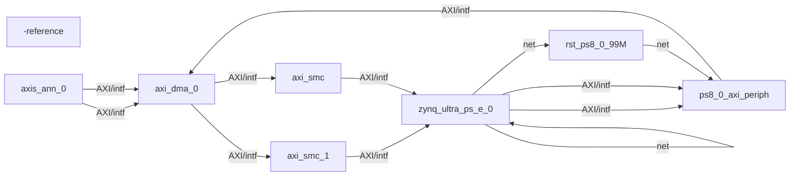

# ANN Accelerator

This repository contains the source code and resources for the inference 6x6 ANN (Artificial Neural Network) Accelerator project. The project aims to develop a hardware accelerator for neural network computations, leveraging various hardware description languages and tools.

<!-- BD_MERMAID_INDEX_START -->

## Vivado Block Designs (auto-generated)

Generated Mermaid files:

- `docs/bd/ASSEMBLY_11.tcl.mmd`
- `docs/bd/ASSEMBLY_6.tcl.mmd`
- `docs/bd/ASSEMBLY_8.tcl.mmd`
- `docs/bd/design_2.tcl.mmd`
- `docs/bd/MASNYA.tcl.mmd`

Preview (first diagram):

<!-- BD_MERMAID_INDEX_END -->